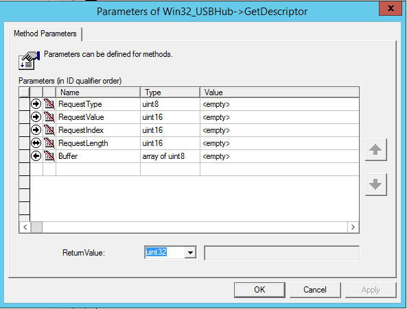

# Welke methode van de Win32_USBHub klasse heeft zowel invoer-, uitvoer- als invoer/uitvoer parameters ?

- GetDescriptor
> De pijltjes duiden op het type. Een pijltje naar rechts is een invoerparameter. Een dubbel pijlte in-uit parameter en een pijltje naar links is een invoerparamter.

