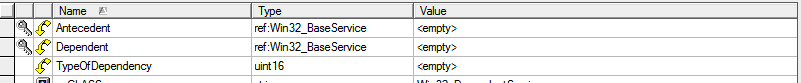

# Wat is er bijzonder aan de verbinding gerealiseerd door de associatorklasse Win32_DependentService? Wat stelt de verbinding voor ? Wat is de betekenis van het extra attribuut? Is dit ingevuld voor bepaalde instanties?

- Heeft twee verbindingen

Het gaat hier om een recursieve relatie. Zoals de naam zegt zijn dit services die van elkaar afhankelijk zijn. Antecedent en Dependent bepalen de volgorde van afhankelijkheid.

TypeOfDependency gaat bepalen hoe ze afhankelijk zijn. Deze waarde heeft volgende values:

- 0 - Unknown
- 1 - Other
- 2 - Service Must Have Completed
- 3 - Service Must Be Started
- 4 - Service must Not Be Started
