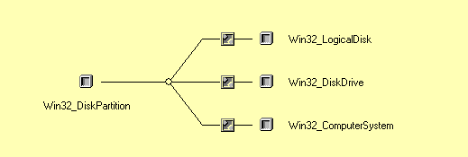
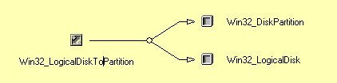
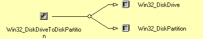

# Er zijn meerdere WMI klassen die de belangrijkste logische en fysieke eigenschappen in verband met schijfpartities  beschrijven. Ze zijn ook onderling verbonden met associatorklassen. Zoek deze klassen en de associatorklassen op en bepaal enkele belangrijke attributen van elke WMI klasse.

Zoek op "partition"

We moeten blijkbaar kijken naar de Win32-klassen. Waarom weet ik niet zo goed... (eens vragen)



Dit is de associatorklasse met als antecedent Win32_DiskToPartition en decendent Win32_LogicalDisk



Dit is de tweede associatorklasse die Win32_DiskDrive als antecedent heeft en Win32_DiskPartition als decendent.




> Antwoord van de prof:

Zoek op "partition" en je vindt de WMI klasse "Win32_DiskPartition". 
In het tabblad "Associations" vind je de figuur zoals hieronder beschreven. 
Hierin vind je alle antwoorden op de vraag:
```
"Win32_LogicalDisk"    (DeviceID, FileSystem, Size, FreeSpace, MediaType, Compressed,... )
         \ Dependent
          |  "Win32_LogicalDiskToPartition"
         / Antecedent
"Win32_DiskPartition"  (DeviceID, PrimaryPartition, StartingOffset, ... )
         \ Dependent
          | "Win32_DiskDriveToDiskPartition"
         / Antecedent
"Win32_DiskDrive"    (DeviceID, Model, InterfaceType, TotalCylinders, TracksPerCylinder, SectorsPerTrack, ... )
```
