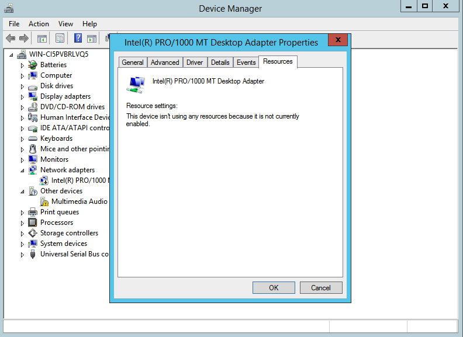
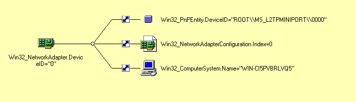
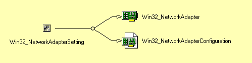

### Zoek in WMI CIM Studio de Win32-klasse die een netwerkverbinding representeert (zoek alle klassen die in hun naam network bevatten). Elke instantie komt overeen met een mogelijke netwerkverbinding.
### Open (met c:\windows\system32\ncpa.cpl) de grafische interface voor netwerkverbindingen. Via welke attributen van het corresponderende WMI-object wordt de beschrijving en de status ter beschikking gesteld ? Hoe kan je bepalen of deze netwerkverbinding geconnecteerd is ?
### Enkel als je ingelogd bent als administrator op je PC kan je met Properties/Eigenschappen - Configure/Configureren meer details opvragen van een netwerkverbinding(*). Als gewone gebruiker vind je die details via de Device Manager/Apparaatbeheer - uit het Control Panel (snel te bereiken via WindowsKnop/Pauze). Als je de beschrijving kent van een bepaalde netwerkverbinding, kan je de details opvragen van de netwerkverbinding , o.a. in de Resources/Bronnen tabpagina.
### De WMI-klasse die een netwerkverbinding voorstelt heeft meerdere associaties. In welke associatie wordt de configuratie van het netwerk bijgehouden - welke informatie vind je daar? De details van de netwerkverbinding(*) vind je terug in een geassocieerde klasse. Zoek die detail-informatie op.
### Let op! De informatie uit het "Resources"-tabblad is niet direct terug te vinden in de associaties van de klasse omdat deze associatie overgeerfd wordt van de klasse "CIM_LogicalDevice". Vraag eerst het WMI-object (instantie) die een actieve netverbinding voorstelt. (vb eth..). Bekijk de associaties met deze instantie en zoek zoveel mogelijk informatie op over de netwerkverbinding in WMI CIM Studio.

De netwerkconnectie heeft als klasse Win32_NetworkAdapter. Waarom niet Win32_NetworkConnection? Op dat vlak ben ik precies niet goed mee.

Run het commando met windows + r. Dan krijg je dit scherm:


Je kan de resources naar het schijnt ook vinden door via device manager te werken in het tabblad resources:



In het attribuut element wordt een referentie naar de associatorklasse Win32_NetworkAdapterSetting bijgehouden. Deze linkt dan weer naar een Win32_NetworkAdapterConfiguration klasse





> Antwoord van de prof
```
De WMI klasse "Win32_NetworkAdapter" stelt een netwerkverbinding voor.
    Het attribuut "Description" bevat de beschrijving van een netwerkverbinding.
    Het attribuut "NetConnectionStatus" bevat de "Status" van een netwerkverbinding 
    Zoek in "Property Qualifiers" de betekenis op van de numerieke waarden  (2=connected) 

Deze klasse is o.a. geassocieerd met de configuratie-klasse, met volgende informatie:
 
"Win32_NetworkAdapterConfiguration" (Index, IPAddress, DHCPEnabled, DNSServerSearchOrder, ...)
         \ Setting
          | "Win32_NetworkAdapterSetting"
         / Element
"Win32_NetworkAdapter" (DeviceID, NetConnectionID, NetConnectionStatus,AdapterType, MACAddress, ... )


Voor een instantie van deze klasse kan je alle geassocieerde klassen bekijken. 
Je vindt er meerdere koppelingen over de associatieklasse "Win32_AllocatedResource"
die de informatie bevat van het "Resources"-tabblad. 

"Win32_NetworkAdapter" (-> subklasse van "CIM_LogicalDevice")
         \ Dependent
          | "Win32_AllocatedResource"
         / Antecedent
Win32-subklassen van "CIM_SystemResource":
     "Win32_DeviceMemoryAddress" (StartingAddress, EndingAddress, Name, ....)
     "Win32_PortResource"        (StartingAddress, EndingAddress, Name, ....)
     "Win32_DMAChannel"          (DMAChannel attribuut)
     "Win32_IRQResource"         (IRQNumber attribuut)	

Je kan ook nagaan dat de klasse "Win32_NetworkAdapter", als subklasse van "CIM_LogicalDevice",
gekoppeld is aan de klasse  "CIM_SystemResource" via de associatorklasse is "Win32_AllocatedResource".
```