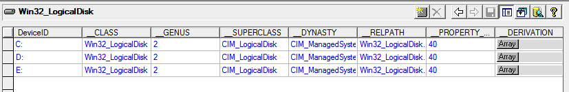
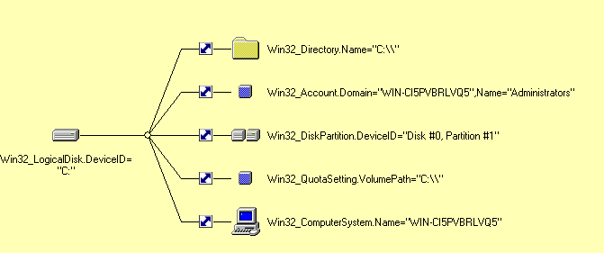
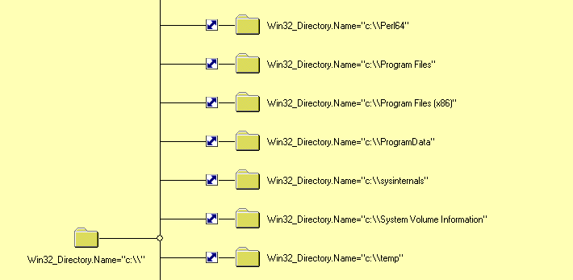
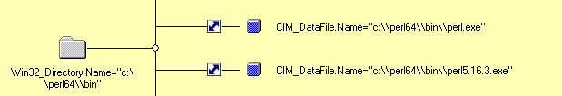
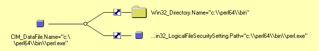
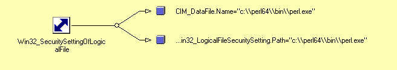
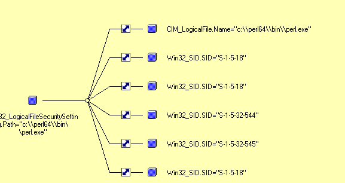
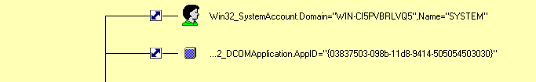
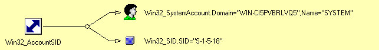
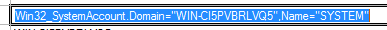

### Selecteer in WMI CIM Studio het object dat met de C: partitie van de harde schijf overeenstemt. Navigeer via Associations tabpagina's naar het object dat de eigenaar van het bestand c:\perl64\bin\perl.exe representeert. Vermeld hierbij via welke associatorklassen (en de corresponderende sleutelattributen hiervan) je telkens gebruik maakt. Soms kan het vrij lang duren voor je de associaties te zien krijgt. Welke van die associatorklassen representeren recursieve verbindingen ?

>In het begin ben ik niet altijd via associatorklassen gegaan. Joris doet dat wel, volg dus in het begin zijn logica.

Bij Logicaldisk instanties vind je volgende informatie:

Dan doe je associations open:

Nu verder navigeren via het attribuut GroupComponent met associatiorklasse Win32_SubDirectory naar C\\\

Nu kan je verder navigeren naar Perl64:

Nu verder navigeren via het attribuut GroupComponent met associatiorklasse Win32_SubDirectory naar \bin

Hier kan je via het attribuut GroupComponent naar de associatorklasse CIM_DirectoryContainsFile naar perl.exe

Hier kan je doorklikken naar de associatorklasse Win32_SecuritySettingOfLocalFile via het attribuut "element". Deze zal de eigenaar van het bestand bevatten.

Doorklikken via het attribuut 'Setting'.

Nu klik je door naar de associatorklasse Win32_LogicalFileOwner via een secuirtysetting attribuut (er zijn er meerdere).

Helemaal bovenaan vind je de klasse die je zoekt:
. Het attribuut is "setting" met als associatorklasse Win32_AccountSID

Deze heeft op zijn beurt een element attribuut met daarin de informatie en een setting attribuut die verwees naar de vorige klasse

Antwoord: 
