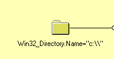

### De rootdirectory van de C:partitie is een instantie van Win32_Directory. Het lukt niet om alle instanties van die klasse te vragen! Je kan wel eerst de Win32_LogicalDisk ophalen die hoort bij de C:-drive, en dan via het Associations tabpagina dit object terugvinden.

Er zijn zowat te veel instanties. De mappen blijven laden. Da's inderdaad niet zo handig. Je kan ook niet rechtsreeks naar C zoeken
Je kan zoeken naar Win32_LogicalDisk. Die heeft een associatorklasse genaamd Win32_LogicalDiskRootDirectory. Je kan de associatorklasse wel niet rechtstreeks ophalen omdat de enige attributen referenties zijn. Daar zie je dat de directory name gelijk is aan "C:\\". 

select * from Win32_Directory where name='c:\\'

>Vergeet niet om backslash te escapen
### Een WQL-query is een zinvol alternatief om toch direct de rootdirectory te connecteren. Stel de WQL-query op die de rootdirectory van de C:partitie direct ophaalt.
