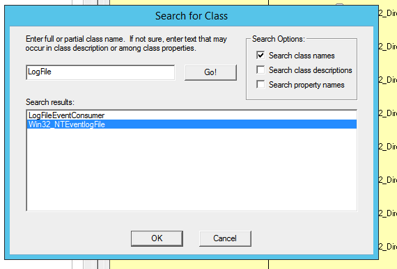
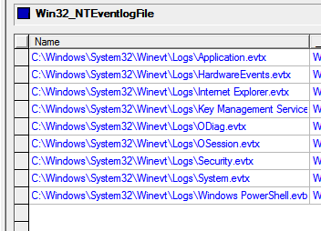

### Alle events die je kan opzoeken in het logboek (dat je opstart met eventvwr) zijn ook beschikbaar via WMI-objecten. Elk logboek is gekoppeld aan een logbestand. Zoek de WMI-klasse op voor een logboekbestand en bekijk de instanties van die klasse. Je vindt er o.a. het logboek waar 'het systeem' en 'toepassingen' hun informatie kunnen plaatsen.

Na een beetje zoeken kom je op Win32_NTEventLogFile uit:
.

Bij name zie je alle verschillende types van logboekbestanden



### Zoek in CIM-studio welke geassocieerde klasse een logitem beschrijft. Bepaal met een WQL-query alle logitems met EventCode=6005 of 6006. Je vindt die o.a. terug in het SYSTEM-logboek. Merk op dat de sourceName voor deze logitems dezelfde is, en gebruik dit om de WQL-query te verfijnen.

Geassocieerde klasse is Win32_NTEventLog. Dat kan je zien door de associations te bekijken en dan te hoveren over een associatorklasse. Daarin ga je dan kijken en dan vind je dat een item een Win32_NTLogEvent is.

```SQL
Select * from Win32_NTLogEvent  Where Logfile = 'System' and SourceName='EventLog' 
      and ( EventCode = '6005' or EventCode = '6006' )
```

>Merk op: in het attribuut Message kan je terugvinden waarom dit logitem aangemaakt werd.