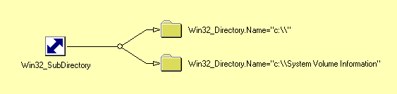

### Beschouw de map c:\perl64\lib. Aan welke klassen is dit object geassocieerd ? Bepaal via WQL queries achtereenvolgens:

#### alle bestanden in deze map
``` SQL
ASSOCIATORS OF {Win32_Directory.Name='c:\perl64\lib'}  WHERE ResultClass = CIM_DataFile
```

####alle submappen van deze map
Role gaat over het object dat je opzoekt met associator of.
ResultRole gaat over het object dat via de associatie bekeken wordt.

```SQL
ASSOCIATORS OF {Win32_Directory.Name='c:\perl64\lib'}  WHERE ResultClass = Win32_Directory
                                                    Role = GroupComponent

ASSOCIATORS OF {Win32_Directory.Name='c:\perl64\lib'}  WHERE ResultRole = PartComponent
```


De associatorklasse bevat het attribuut GroupComponent met de oudermap en PartComponent met de descendant.


####de map waarvan c:\perl64\lib een submap is.
```SQL
ASSOCIATORS OF {Win32_Directory.Name='c:\perl64\lib'}
WHERE ResultRole = GroupComponent

ASSOCIATORS OF {Win32_Directory.Name='c:\perl64\lib'}
WHERE ResultClass = Win32_Directory
Role = PartComponent

```