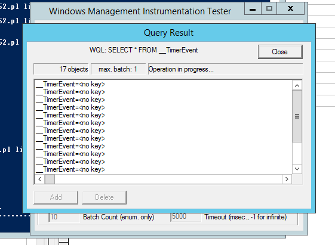

# Oefening 33
 
1. __TimerInstruction object gaan aanmeken om om de seconde een timerevent te genereren
Klik op new Instance rechts bovenaan in __IntervalTimerInstruction object.


2. Nu de events gaan opvragen in WbemTest
```WQL
select * from __TimerEvent
```

