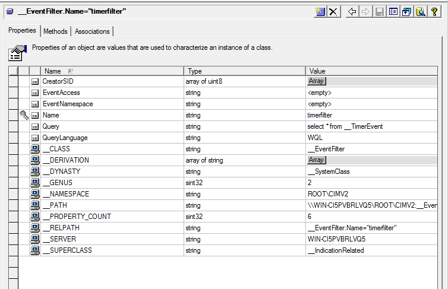
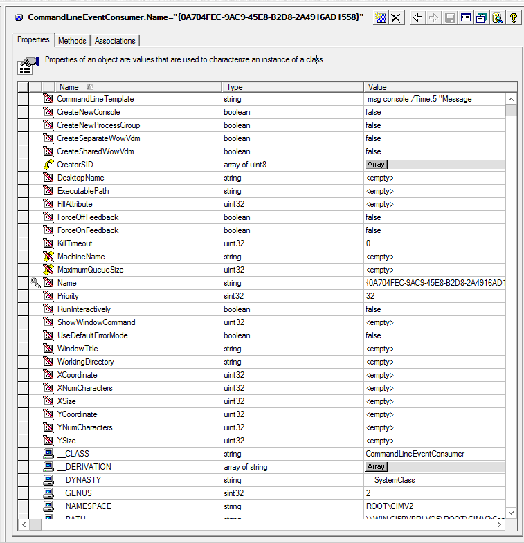

# Oefening 39

We gaan reageren op TimerEvents. We hebben in oefening 33 gezien hoe we TimerEvents genereren dus nu gaan we kijken hoe we erop gaan reageren.

We moeten daarvoor een aantal zaken gaan doen (zie les 3 theorie).

1. Maak een __EventFilter aan die zoekt naar TimerEvents__


2. Toon een reactie. Dit kunnen we doen met een standaardconsumer uit WMI, genaamd CommandLineEventConsumer


3. Koppelen door een instantie te maken van FilterToConsumerBinding
absolute paden van de 
- EventFilter: ```\\WIN-CI5PVBRLVQ5\ROOT\CIMV2:__EventFilter.Name="timerfilter"```
- Consumer: ```\\WIN-CI5PVBRLVQ5\ROOT\CIMV2:CommandLineEventConsumer.Name="{FB4882C3-6CCE-488D-9053-A96617E73127}"```

We moeten hetgeen voor de root aanpassen door \\.

Dus:
- EventFilter: ```\\.\ROOT\CIMV2:__EventFilter.Name="timerfilter"```
- Consumer: ```\\.\ROOT\CIMV2:CommandLineEventConsumer.Name="{FB4882C3-6CCE-488D-9053-A96617E73127}"```

Dan moet je messages beginnen binnen krijgen