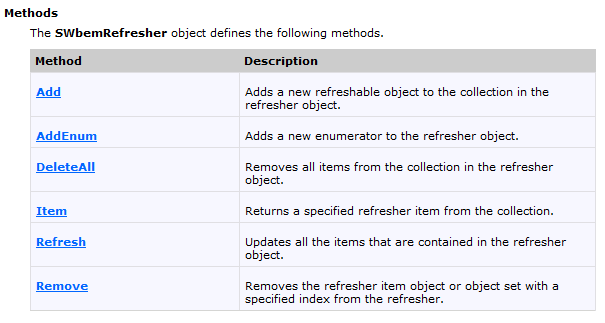

# Theorie eventlabo

- Standaard eventconsumers: kunnen standaard zeer veel 
- Ontwikkelen van eventconsumers op maat gaan wij niet doen
- Ontwikkelen van consumerscript ==> tijdelijke eventregistratie want als script stopt, stopt ook de consumer

## 3 manieren bij het ontwikkelen van een script:
1. Oneindige lus uitvoeren in script
we gaan periodiek aan de WMI Service vragen wat we moeten doen. 
Hoe laten we iets periodiek gaan als het een oneindige lus is? 
>Win32::Sleep.

De WMIService werkt met caching. Het script zal dus geen wijzigingen merken wanneer attributen veranderen. 
> Je kan Refresh_() gebruiken van het WMIObject om dit op te vangen maar dit heeft heel veel belasting op het systeem

Dit heet externe polling en zullen we niet gebruiken.
>Oplossing: Een SWBemRefresherObject creeëren. met Win32::OLE->new("WbemScripting.SWbemRefresher").

#### Methodes van SWbemRefresher

#### SWbemRefresher object
Container van SWBemobjecten. Heeft een methode "refresh" die attributen opnieuw inladen.
##### Methodes van SWbemRefresher

- Add en AddEnum zijn equivalent met Get en InstancesOf. 
>Vermijden van AddEnum als je Add kan gebruiken. Zeker als het om singleton klassen gaat.
Returnwaarde van deze methoden zijn SWbemRefreshableItem objecten.

##### SWnemRefreshableItem
- Object & ObjectsSet halen het object op. Niet nodig om ze zo op te halen want je kan ze ophalen met de Item methode met als argument een indexnummer.

- IsSet kijkt of je Object of ObjectSet moet gebruiken om het item i-op te halen 

2. Synchrone EventConsumers
