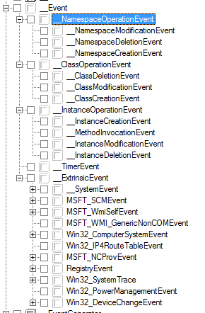
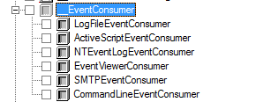

# Samenvatting voor events

## Manieren om erachter te komen welk event
Stel: Je wil events ophalen van een bepaalde klasse maar je weet niet hoe het event precies heet.
Je kan gaan zoeken naar events in CIM Studio op volgende manier:

### Eerste manier
Alle subklasses van Event zijn speciaal. Je kan rechtstreeks een notification query uitvoeren op volgende manier:
```WQL
select * from __TimerEvent
```

Soms weet je echter niet over welk event het gaat maar wel welke klasse

### Tweede manier
met subklasses van __InstanceOperationEvent.
Stel dat je wel weet dat een instantie aangemaakt wordt kan je het volgende doen:
```WQL
select * from __InstanceCreationEvent within 5 where TargetInstance ISA 'Klassenaam' and TargetInstance.Property = 'propertyvalue'
```
> Within 5 zorgt voor een timeout van 5 seconden bij het ophalen van Events

> Via TargetInstance kan je aan properties van de doelklasse


## Synchrone (ook wel semi asynchrone) eventconsumers
Om dit type te kunnen ophalen heb je een EventSource nodig. Die bekom je door een
notification query op $wbemserivces uit te voeren.
Daarna kunnen we een event opvragen met NextEvent() van deze EventSource.
Opletten dat je zeker de schrijfbuffer \$| instelt op een verschillende waarde van 0

Voorbeeld basisscript:
```perl
my $WbemServices = Win32::OLE->GetObject("winmgmts://$ComputerName/$NameSpace");
my $NotificationQuery = "...";

$| = 1; 
my $SWbemEventSource = $WbemServices->ExecNotificationQuery($NotificationQuery);

while(1){
    my $Event = $SWbemEventSource->NextEvent(5000);
    # Doe iets met event
}
```
> Bij nextEvent kan je een timeout plaatsen om bijvoorbeeld iets op het scherm te schrijven na 5 seconden en dan opnieuw te kijken

## Asynchrone eventconsumers
Hier combineer je een gewone eventcosumer met een callback. Hiervoor heb je een Sink nodig. 
Je kan een callbackfunctie toevoegen aan de Sink. 
Ambetant wel: Je hebt per sink maar 1 callbackfunctie.
In een oefening op asynchrone eventconsumers moesten we objecten uit verschillende namespaces koppelen aan 1 callback. We moesten hiervoor meerdere $WbemServices aanmaken
```perl
my $Sink = Win32::OLE->new ('WbemScripting.SWbemSink');
Win32::OLE->WithEvents($Sink,\&EventCallBack); 
my $Query1 = "...";
my $Query2 = '...';

$WbemServices->ExecNotificationQueryAsync($Sink, $Query1); 
$WbemServices->ExecNotificationQueryAsync($Sink, $Query2); 

sub EventCallBack {
    # Je krijgt deze waarden terug
    my ($Source,$EventName,$Event,$Context) = @_;
    $Event->TargetInstance; #Dit is de klasse die je terugkrijgt met de queries
    # Doe iets
    # Je kan hier ook filteren op $EventName
}

while(1){
    # Nodig, anders worden geen events uitgeschreven
    Win32::OLE->SpinMessageLoop();
    Win32::Sleep(500);
}
```

> De laatste lus vervang je best door omdat je dan input kan geven om de lus te stoppen
```perl
my $Console  = new Win32::Console(STD_INPUT_HANDLE);  #creeert een nieuw Console object
$Console->Mode( ENABLE_PROCESSED_INPUT);    #enkel reageren op toetsen, niet op muis-bewegingen
 
  $|=1; 
  print "Wacht op een actie .";
 
  until ($Console->Input()) {   #zolang er geen input is
        Win32::OLE->SpinMessageLoop();
        Win32::Sleep(500);
  }
```

## Permanente eventregistratie
Hier is het stramien altijd hetzelfde. Je hebt drie dingen nodig.
1. EventFilter
2. Consumer
3. FilterToConsumerBinder

Je moet deze objecten creeëren. Dit doe je door:
```perl
my $EventFilterClass = $WbemServices->Get("__EventFilter", wbemFlagUseAmendedQualifiers);
my $EventFilterInstance = $EventFilterClass->SpawnInstance_();
```

Daarna zet je de properties goed:
``` perl 
$EventFilter->{Query} = $Query;
$EventFilter->{QueryLanguage} = 'WQL';
```

En sla je hem op. Dit doe je door put. Best geef je ook de wbemFlagUseAmendedQualifiers mee. Soms zaagt hij daarover.
```perl
$EventFilter->Put_(wbemFlagUseAmendedQualifiers);
```

Je hebt keuze uit verschillende Consumers. 

De belangrijkste is de CommandLineEventConsumer. Maar om te loggen is de LogFile... ook interessant. Om te mailen gebruik je SMTPEventConsumer.
Maak de oefeningen om te zien hoe dat precies werkt.

We kunnen ook een ActiveScriptEventConsumer gaan gebruiken. Configuratie werkt zo:
```perl
my $Consumer = $WbemServices->Get("ActiveScriptEventConsumer")->SpawnInstance_();
$Consumer->{Name} = "test";
$Consumer->{ScriptingEngine} = "PerlScript";

# TODO: Wat doet die Debug weer in dat script bij het aanmaken van $WbemServices?
$Consumer->{ScriptText} = q[
    # Schrijf hier je Perl script
    # Werk je met de eerste manier van events?
    # $TargetInstance is meteen beschikbaar
    # tweede manier: $TargetEvent->{TargetInstance}
    ];
my $ConsumerPath = $Consumer->Put_(wbemFlagUseAmendedQualifiers);
```
