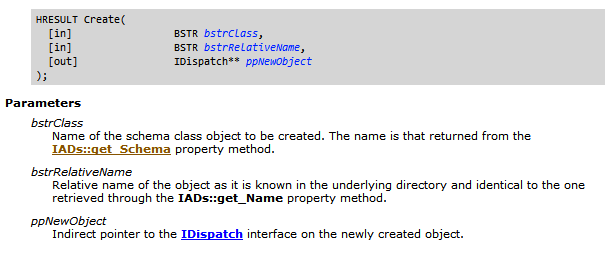
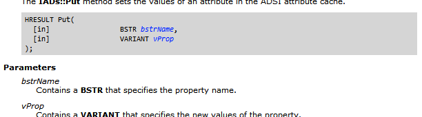
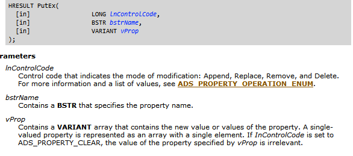
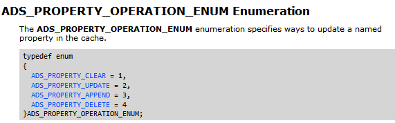
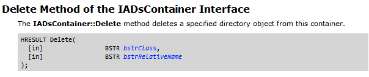
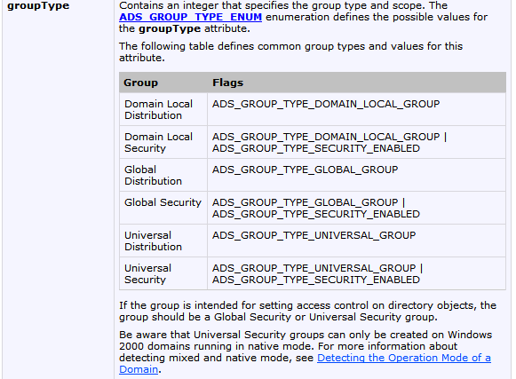
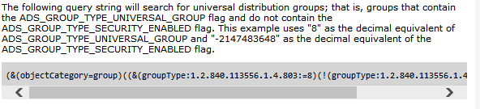

# Reeks 8

- We gebruiken vaak LDAPQueries uit reeks 7.

## Maken van objecten

Je gebruikt hiervoor de `Create` methdoe van een container


- Er zijn verplichte attributen van een klasse
  - Volgens de oefeningen kan je die bekomen door het abstracte schema (met `MandatoryProperties`).
    Volgens mij hebben we dit wel nooit gedaan eigenlijk. MAAR CHECK DAT DUS NOG EENS
- Sommige attributen moeten ook uniek zijn als je een klasse maakt zoals
  - cn (CanonicalName)
  - SamAccountName

Voorbeeldje:

```perl
# Controle van cn
# Die split staat er om het laatste element gescheiden door '/' op te halen. Het is net dit wat uniek moet zijn
foreach (in $container){
    $_->GetInfoEx(["canonicalName"], 0);
    $names{(split('/',$_->Get("canonicalName")))[-1]} = undef;
}

# Als je moet controleren of SamAccountName uniek is zit er niets anders op dan een LDAP-query te schrijven
# Je moet de resultset niet overlopen. Gewoon kijken of er onmiddellijk EOF is.
# Zo dus: (even de rest van de query weggelaten):
$ADOrecordset->{EOF} or die "Samnaam moet uniek zijn !!";

# Nieuwe OU maken, tweede argument is cn
my $newOrganizationalUnit = $container->Create("organizationalUnit", "ou=test");
# Altijd controleren op fouten
die "Fout bij het maken van de container\n" if !$newOrganizationalUnit;
# De wijzigingen zijn nu nog niet doorgevoerd:
$newOrganizationalUnit->SetInfo();
die "Fout bij het maken van de container\n" if !$newOrganizationalUnit;
```

## Een object updaten

Dit kan op verschillende manieren. Met `Put`, `PutEx` en `$_->{[ADSIATTRIBUUT]} = ...`.
Dit zijn methodes van de Core Interface IADs

- `Put` : voor enkelvoudige attributen:
  
- `PutEx` : voor multivalued attributen. Je moet hier ook een ControlCode meegeven:
  
- `$_->{[ADSIATTRIBUUT]} = ...`
  Dit gaat alleen met ADSI-attributen

## Een object updaten met Property Cache Interfaces

1. De properties die je wil aanpassen moet je ophalen met methodes uit de Property Cache Interfaces. Zie blad

```perl
$_->GetInfo();

$cn = $_->GetPropertyItem("cn", ADSTYPE_CASE_IGNORE_STRING);
$mail = $_->GetPropertyItem("mail", ADSTYPE_CASE_IGNORE_STRING);
```

2. Instellen van de controlCode. Deze gaat bepalen wat er met de property moet gebeuren.
   Het overzicht kan je vinden door een beetje door te klikken
   

```perl
$mail->{ControlCode} =  ADS_PROPERTY_APPEND;
```

3. Dan de value gaan aanpassen met een methode uit `IADsPropertyValue2`

```perl
$mail->{Values}->[0]->PutObjectProperty(ADSTYPE_CASE_IGNORE_STRING, $waarde);
```

4. Dan de property nog eens setten door een methode van `IADsPropertyList`

```perl
$_->PutPropertyItem($mail);
```

5. SetInfo nog eens aanroepen:

```perl
$_->SetInfo();
```

## Een object verwijderen

Door de delete methode van `IADsContainer`


```perl
$cont->delete ($_->{class},$_->{name});
```

## Groepen

Zie oefening 10 en voer dat eens uit.

- Zie ook documentatie

Er zijn 6 verschillende groepen. Deze zijn elk opgebouwd uit een aantal flags uit groupType.
Als je deze groepen wilt zoeken met een LDAP query moet je filteren op dat groupType.
De Flags zijn bits en het zijn constanten die je gewoon ter beschikking hebt als je de library
importeert.



Als je wat doorklikt naar `Enumarting Groups > Searching for Groups by Scope or Type in a domain`
vind je hoe je moet zoeken in een filter naar deze groepen.



## Groepen toevoegen

- cn moet uniek zijn
- samAccountName ook

Zelfde werkwijze als daarnet.

## Users aan een groep toevoegen.

Een group is geen container zoals ik eerst dacht. Het is voldoende om de users die je wil toevoegen in een array
te steken en het `member` attribuut van de group in te stellen met de referentie
naar deze array met `distinguishedNames`:

```perl
foreach (in $cont) {
push @leden ,$_->{distinguishedName};
}

$groep->PutEx(ADS_PROPERTY_UPDATE,"member",\@leden); #ADS_PROPERTY_UPDATE=2
$groep->SetInfo();
```
